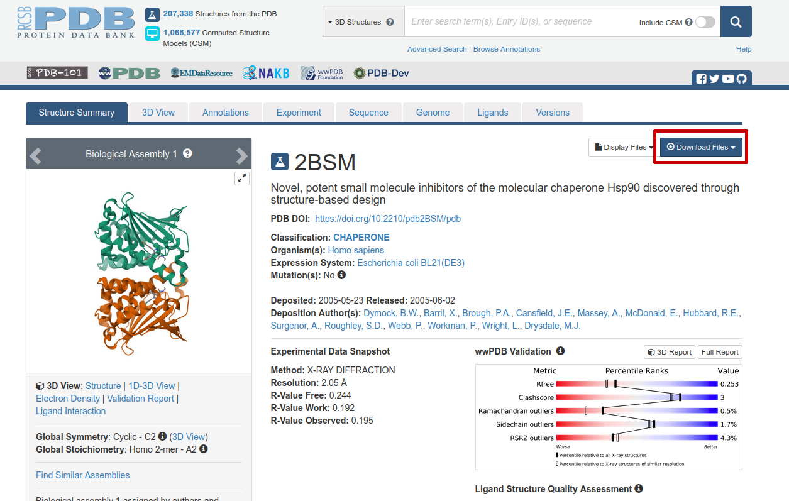
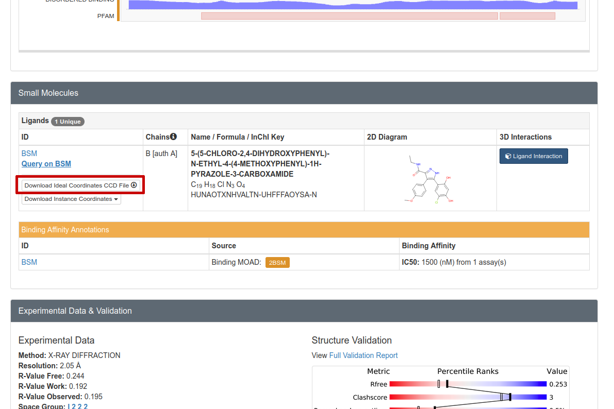
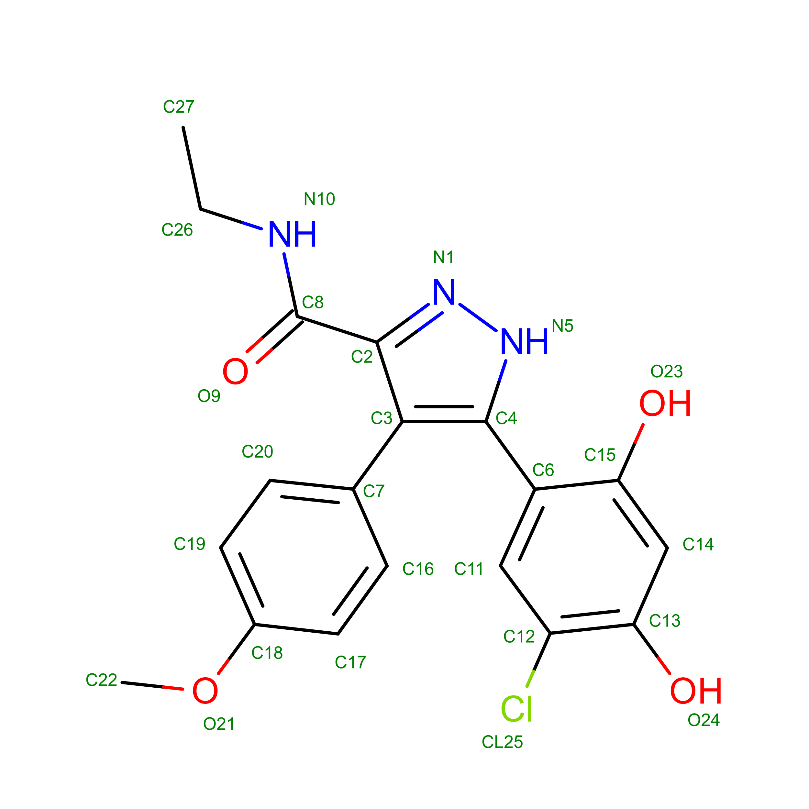

Tutorial: Running Qmrebind on the HSP90 System
==============================================

In this tutorial, we will be parametrizing the HSP90 protein with an 
inhibitor using the LEAP and antechamber tools. We will then 
replace the inhibitor partial charges using qmrebind to generate more
accurate parameters for simulation (in SEEKR2 or another application).

Initial Parametrization
-----------------------

Let us start with the protein databank (PDB) crystal structure 2BSM (where
the inhibitor is also known as compound 3)[1].

Follow the link to the PDB page for HSP90/inhibitor: 
https://www.rcsb.org/structure/2BSM. 

   
   Figure 1: The Protein Data Bank entry we will use as a starting structure for
   our qmrebind calculations of HSP90/compound3 (ID: 2BSM).
   
Click on "Download Files" near the top right (circled in red in Figure 1). Then
select "PDB Format". Save the file "2bsm.pdb" somewhere on your hard drive.

Further down on the same page, one should download the CIF file for the
inhibitor:

   
   Figure 2: We must download the CIF file in order to parametrize the
   small molecule inhibitor.

Click on "Download Ideal Coordinates CCD File" near the top right 
(circled in red in Figure 2). Then save the file "BSM.cif" somewhere on your 
hard drive.

At this stage, many people will "clean" their PDB file using various tools.
For instance, the Schrödinger commercial software, if available to you, 
includes a PDB cleaner. 

.. note::
  This process has been greatly simplified for demonstration purposes. When
  preparing your own system for a qmrebind calculation, many other procedures
  should be observed, including, for instance, **assigning the correct
  protonation states to histidine residues**. You should either consult an
  expert at preparing molecular dynamics (MD) simulations, or become an
  expert yourself before proceeding with your own system(s) of interest.
  

Use Antechamber to Parametrize Ligand
-------------------------------------

We must perform an initial parametrization of the small molecule inhibitor. 
One way to do this is with the Antechamber program in AmberTools.

Here, we will use Antechamber to parametrize our ligand: the small molecule 
compound 3.

   
   Figure 3: Compound 3 inhibitor of HSP90, resname: "BSM".

Antechamber requires a structure file to parametrize the small molecule. In 
this case, we will use a CIF file we just downloaded.

First, see if you have Antechamber::

  which antechamber

If this returns a path, you should be good. Otherwise, you'll need to install 
AmberTools. If antechamber exists on your computer, run the following command::

  antechamber -i BSM.cif -fi ccif -bk BSM -o BSM.mol2 -fo mol2 -c bcc -nc 0

Each argument means the following information:

**-i BSM.cif** - Take the BSM.cif file as the input structure.

**-fi ccif** - The format of BSM.cif is in CIF format.

**-bk BSM** - The component/block ID for compound 3 in the PDB file is "BSM".

**-o BSM.mol2** - Specify output file name of compound 3 molecule.

**-fo mol2** - Output the BSM.mol2 file in MOL2 format.

**-c bcc** - Use the AM1-BCC semi-empirical method to assign partial charges
of the atoms.

**-nc 0** - This molecule has no net molecular charge.

Use the parmchk2 program to generate a frcmod file, which LEAP will need to
create the bound system::

  parmchk2 -i BSM.mol2 -f mol2 -o BSM.frcmod
  
Then, generate a ".lib" file which will contain a library of forcefield 
parameters for the compound 3 molecule. Enter the following commands into 
the terminal::
  
  tleap
  source leaprc.gaff
  BSM = loadmol2 BSM.mol2
  saveoff BSM BSM.lib
  quit

Use LEAP to Create the Forcefield Parameters for the Solvated System
--------------------------------------------------------------------

.. note::
  You should remove all CONECT records from your PDB files before using
  LEAP.

Now with a text editor, copy the following script to a file named **leaprc**::

  source leaprc.protein.ff14SB
  source leaprc.gaff
  source leaprc.water.tip3p
  set default PBRadii mbondi2
  loadoff BSM.lib
  loadamberparams BSM.frcmod
  WAT = TP3
  HOH = TP3
  loadAmberParams frcmod.tip3p
  mol = loadpdb 2bsm.pdb
  solvatebox mol TIP3PBOX 10
  addIons2 mol Na+ 0
  addIons2 mol Na+ 24
  addIons2 mol Cl- 24
  saveamberparm mol hsp90_compound3.parm7 hsp90_compound3.rst7
  savepdb mol hsp90_compound3.pdb
  check mol
  charge mol
  quit

Then, run LEAP with the following command::

  tleap -f leaprc

If everything runs correctly, the files **tryp_ben.prmtop** and 
**tryp_ben.inpcrd** should be generated. 

References
----------
1. Kokh DB, Amaral M, Bomke J, Grädler U, Musil D, Buchstaller HP, Dreyer MK, 
Frech M, Lowinski M, Vallee F, Bianciotto M, Rak A, Wade RC. Estimation of 
Drug-Target Residence Times by τ-Random Acceleration Molecular Dynamics 
Simulations. J Chem Theory Comput. 2018 Jul 10;14(7):3859-3869. 
doi: 10.1021/acs.jctc.8b00230.